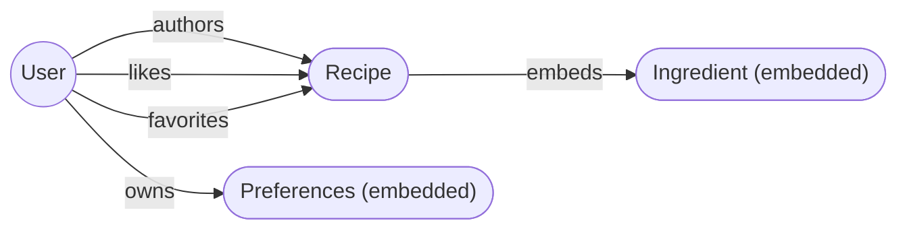
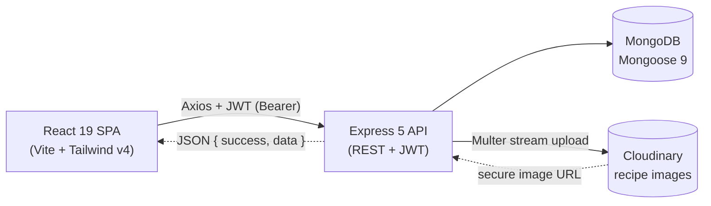

<div align="center">
  <p>
    
    <strong> Recipe MERN</strong>
  </p>

  <h1>Recipe MERN</h1>

  <p><em>A full-stack recipe sharing platform with JWT authentication, role-based access control, Cloudinary image uploads, favorites &amp; likes, a tabbed settings experience, and an admin dashboard — built on a modern MERN architecture.</em></p>

  <p>
    
    
    
    
    
    
    
    
    
  </p>

  <p>
    <a href="https://recipe-mernn.netlify.app/">Live Demo</a> •
    <a href="#features">Features</a> •
    <a href="#installation">Quick Start</a> •
    <a href="#api-endpoints">API Docs</a> •
    <a href="#architecture">Architecture</a>
  </p>
</div>

---

## Features

- **User Authentication** — Secure register and login with JWT-based stateless authentication
- **Role-Based Access Control** — Guest, User, and Admin roles with granular, server-enforced permissions
- **Recipe CRUD** — Create, read, update, and delete recipes with rich, dynamic forms and draft/published status
- **Image Upload** — Cloudinary integration via Multer with auto-cleanup of orphaned images
- **Search, Filter &amp; Sort** — Title search, category and difficulty filters, plus newest/oldest/popular/quickest sorting
- **Favorites System** — Save recipes to a personal collection with one-tap toggle
- **Like System** — Like/unlike recipes with an accurate, denormalized like counter for reliable popularity sorting
- **Drag &amp; Drop** — Reorder ingredients and recipe steps with the accessible @dnd-kit sortable toolkit
- **Admin Dashboard** — Platform statistics, user management, and recipe moderation
- **Public Profiles** — User profiles with privacy controls (show/hide email and favorites)
- **Preferences** — Theme (light/dark/system), font size, content density, and animation toggles synced to the server
- **Settings Panel** — Tabbed settings: profile, account, appearance, and privacy
- **Responsive Design** — Mobile-first layout that adapts seamlessly across devices
- **Skeleton Loading** — Smooth loading states for cards and detail pages
- **Security Hardened** — Helmet (with CSP), rate limiting, Mongo sanitization, HPP protection, and input validation
- **API Documentation** — Interactive Swagger UI available at `/api-docs`

---

## Live Demo

[View Live Demo](https://recipe-mernn.netlify.app/)

---

## Architecture

A high-level visual map of the system. Both diagrams render natively on GitHub thanks to Mermaid support.

### Domain Model

How the core documents relate to each other in MongoDB.



### Request Lifecycle

How a single browser action travels through the stack.



---

## Technologies

### Frontend

- **React 19** — Modern UI library with hooks, context, and functional components
- **Vite 8** — Lightning-fast build tool and dev server with HMR
- **Tailwind CSS 4** — Utility-first CSS framework with CSS-first configuration (`@theme`)
- **React Router 7** — Client-side routing with nested layouts and route guards
- **Axios** — Promise-based HTTP client with request/response interceptors
- **@dnd-kit** — Accessible drag-and-drop toolkit for sortable ingredient and step lists
- **Lucide React** — Consistent, lightweight icon library
- **react-hot-toast** — Customizable toast notifications

### Backend

- **Node.js** — Server-side JavaScript runtime
- **Express 5** — Minimal and flexible web application framework
- **MongoDB (Mongoose 9)** — NoSQL database with elegant object data modeling
- **JWT (jsonwebtoken)** — Stateless authentication with token-based sessions
- **bcryptjs** — Secure password hashing with 12 salt rounds
- **Cloudinary + Multer** — Cloud-based image upload, storage, and transformation
- **express-validator** — Declarative input validation and sanitization
- **Helmet** — Secure HTTP headers (with a Swagger-compatible CSP)
- **express-rate-limit** — Global and route-specific rate limiting
- **HPP** — HTTP Parameter Pollution protection
- **Swagger (swagger-jsdoc + swagger-ui-express)** — Interactive API documentation

---

## Installation

### Prerequisites

- **Node.js** v18+ and **npm**
- **MongoDB** — MongoDB Atlas (free tier) or a local instance
- **Cloudinary** — Free account at [cloudinary.com](https://cloudinary.com)

### Local Development

**1. Clone the repository:**

```bash
git clone https://github.com/Serkanbyx/recipe-mern.git
cd recipe-mern
```

**2. Set up environment variables:**

```bash
cp server/.env.example server/.env
```

**server/.env**

```env
NODE_ENV=development
PORT=5000
MONGO_URI=your_mongodb_connection_string
JWT_SECRET=your_strong_secret_key
JWT_EXPIRES_IN=7d
CORS_ORIGIN=http://localhost:5173
CLOUDINARY_CLOUD_NAME=your_cloud_name
CLOUDINARY_API_KEY=your_api_key
CLOUDINARY_API_SECRET=your_api_secret
```

**client/.env** (optional — the Vite dev server proxies `/api` to the backend by default)

```env
VITE_API_URL=http://localhost:5000/api
```

**3. Install dependencies:**

```bash
cd server && npm install
cd ../client && npm install
```

**4. Seed the database:**

```bash
cd server
npm run seed          # create the initial admin user
npm run seed:recipes  # (optional) seed 14 sample recipes
```

**5. Run the application:**

```bash
# Terminal 1 — Backend
cd server && npm run dev

# Terminal 2 — Frontend
cd client && npm run dev
```

The frontend runs on `http://localhost:5173` and the API on `http://localhost:5000` (Swagger UI at `http://localhost:5000/api-docs`).

### Cloudinary Setup

1. Create a free account at [cloudinary.com](https://cloudinary.com)
2. Go to **Dashboard** → copy **Cloud Name**, **API Key**, and **API Secret**
3. Add the values to `server/.env`

---

## Usage

1. **Browse Recipes** — Visit the homepage to explore recipes by category, difficulty, or search keywords
2. **Register** — Create a new account with name, email, and password
3. **Login** — Sign in to access authenticated features
4. **Create Recipe** — Fill in the form: title, description, ingredients, steps, image, category, difficulty, and prep/cook time
5. **Manage Recipes** — Edit or delete your own recipes from the "My Recipes" page
6. **Like &amp; Favorite** — Like recipes and save them to your favorites collection
7. **Customize Settings** — Update profile info, password, theme preferences, and privacy settings
8. **Admin Panel** — With an admin role, manage users and moderate recipes from the dashboard

---

## How It Works?

### Authentication Flow

The application uses JWT-based stateless authentication. On login/register, the server generates a signed JWT and returns it to the client. The Axios instance attaches this token to every request via an interceptor. On a `401` response, the interceptor clears local storage and redirects to the login page.

```javascript
api.interceptors.request.use((config) => {
  const token = localStorage.getItem('token');
  if (token) {
    config.headers.Authorization = `Bearer ${token}`;
  }
  return config;
});
```

### Authorization Middleware

The backend uses three middleware layers for access control:

- **protect** — Verifies the JWT and attaches the user to `req.user`
- **optionalAuth** — Attaches the user if a token is present, otherwise sets `req.user = null`
- **adminOnly** — Allows the request only when `req.user.role === 'admin'`

### Data Flow

1. **Client** → Axios service functions call the REST API
2. **Server** → Express routes validate input via `express-validator`, then delegate to controllers
3. **Controllers** → Execute business logic using Mongoose models
4. **Database** → MongoDB stores Users and Recipes with referenced relationships (author, likes, favorites)

### Roles &amp; Permissions

| Action            | Guest | User | Admin |
| ----------------- | :---: | :--: | :---: |
| View recipes      |   ✅   |  ✅  |   ✅   |
| Search &amp; filter   |   ✅   |  ✅  |   ✅   |
| Register / Login  |   ✅   |  —   |   —   |
| Create recipe     |   —   |  ✅  |   ✅   |
| Edit own recipe   |   —   |  ✅  |   ✅   |
| Delete own recipe |   —   |  ✅  |   ✅   |
| Like / favorite   |   —   |  ✅  |   ✅   |
| Edit any recipe   |   —   |  —   |   ✅   |
| Delete any recipe |   —   |  —   |   ✅   |
| Manage users      |   —   |  —   |   ✅   |
| View dashboard    |   —   |  —   |   ✅   |

---

## API Endpoints

### Auth

| Method | Endpoint                | Auth     | Description             |
| ------ | ----------------------- | -------- | ----------------------- |
| POST   | `/api/auth/register`    | No       | Create a new user       |
| POST   | `/api/auth/login`       | No       | Login and receive a JWT |
| GET    | `/api/auth/me`          | Yes      | Get current user        |
| GET    | `/api/auth/users/:id`   | Optional | Get public user profile |
| PUT    | `/api/auth/profile`     | Yes      | Update profile          |
| PUT    | `/api/auth/password`    | Yes      | Change password         |
| PUT    | `/api/auth/preferences` | Yes      | Update preferences      |
| DELETE | `/api/auth/account`     | Yes      | Delete account          |

### Recipes

| Method | Endpoint                  | Auth              | Description                                    |
| ------ | ------------------------- | ----------------- | ---------------------------------------------- |
| GET    | `/api/recipes`            | No                | List recipes (search, filter, sort, paginate)  |
| GET    | `/api/recipes/my`         | Yes               | List own recipes                               |
| GET    | `/api/recipes/slug/:slug` | No                | Get recipe by slug                             |
| GET    | `/api/recipes/:id`        | No                | Get recipe by ID                               |
| POST   | `/api/recipes`            | Yes               | Create recipe                                  |
| PUT    | `/api/recipes/:id`        | Yes (owner/admin) | Update recipe                                  |
| DELETE | `/api/recipes/:id`        | Yes (owner/admin) | Delete recipe                                  |
| PUT    | `/api/recipes/:id/like`   | Yes               | Toggle like                                    |
| POST   | `/api/recipes/upload`     | Yes               | Upload recipe image                            |

### Favorites

| Method | Endpoint                         | Auth | Description          |
| ------ | -------------------------------- | ---- | -------------------- |
| GET    | `/api/favorites`                 | Yes  | List favorites       |
| PUT    | `/api/favorites/:recipeId`       | Yes  | Toggle favorite      |
| GET    | `/api/favorites/check/:recipeId` | Yes  | Check if favorited   |

### Admin

| Method | Endpoint                    | Auth  | Description      |
| ------ | --------------------------- | ----- | ---------------- |
| GET    | `/api/admin/dashboard`      | Admin | Dashboard stats  |
| GET    | `/api/admin/users`          | Admin | List all users   |
| GET    | `/api/admin/users/:id`      | Admin | Get user details |
| PUT    | `/api/admin/users/:id/role` | Admin | Change user role |
| DELETE | `/api/admin/users/:id`      | Admin | Delete user      |
| GET    | `/api/admin/recipes`        | Admin | List all recipes |
| DELETE | `/api/admin/recipes/:id`    | Admin | Delete recipe    |

> All authenticated endpoints require an `Authorization: Bearer <token>` header. Interactive docs are available at `/api-docs` (Swagger UI).

---

## Project Structure

A clean monorepo layout with an explicit backend / frontend split. Each panel below is collapsible — expand the one you care about.

<details open>
<summary><b>Server</b> — Express 5 API</summary>

```
server/
├── config/
│   ├── cloudinary.js     # Cloudinary SDK configuration
│   ├── db.js             # MongoDB connection
│   ├── env.js            # Centralized env loading + production validation
│   └── swagger.js        # Swagger / OpenAPI spec
├── controllers/
│   ├── adminController.js
│   ├── authController.js
│   ├── favoriteController.js
│   └── recipeController.js
├── middlewares/
│   ├── authMiddleware.js # protect, optionalAuth, adminOnly
│   ├── errorHandler.js   # global error handler
│   ├── rateLimiter.js    # global + route-specific limits
│   ├── sanitize.js       # Express 5 compatible Mongo sanitizer
│   ├── upload.js         # Multer + Cloudinary storage
│   └── validate.js       # express-validator result handler
├── models/
│   ├── Recipe.js         # slug, ingredients, likes, likesCount
│   └── User.js           # auth, preferences, favorites, roles
├── routes/
│   ├── adminRoutes.js
│   ├── authRoutes.js
│   ├── favoriteRoutes.js
│   └── recipeRoutes.js
├── utils/
│   ├── generateToken.js  # JWT sign helper
│   ├── helpers.js        # regex escape, Cloudinary delete
│   ├── seed.js           # admin user seed
│   └── seedRecipes.js    # sample recipe seed
├── validators/           # auth, recipe, favorite, admin rule sets
├── index.js              # app composition: middleware + routes
├── .env.example
└── package.json
```

</details>

<details>
<summary><b>Client</b> — React 19 + Vite SPA</summary>

```
client/
├── public/               # _redirects, favicon.svg, icons.svg
├── src/
│   ├── components/
│   │   ├── guards/        # AdminRoute, GuestOnlyRoute, ProtectedRoute
│   │   ├── layout/        # AdminLayout, MainLayout, SettingsLayout, Navbar, Footer
│   │   ├── recipe/        # RecipeCard, RecipeGrid, SearchBar, CategoryFilter, IngredientForm, StepForm
│   │   ├── ui/            # Pagination, ConfirmModal, skeletons, badges, toggles…
│   │   └── ErrorBoundary.jsx
│   ├── contexts/          # AuthContext, PreferencesContext
│   ├── hooks/             # useAuth, usePreferences, useDebounce, useLocalStorage
│   ├── pages/             # auth/, admin/, user/, Home, RecipeDetail, Create/Edit, MyRecipes…
│   ├── services/          # api, auth, recipe, favorite, admin, user
│   ├── utils/             # constants, helpers, formatDate
│   ├── App.jsx            # router + route guards
│   ├── main.jsx           # entry point + providers
│   └── index.css          # Tailwind v4 imports + theme tokens
├── index.html
├── vite.config.js
└── package.json
```

</details>

<details>
<summary><b>Repository root</b> — governance &amp; shared config</summary>

```
recipe-mern/
├── client/               # → see Client panel above
├── server/               # → see Server panel above
├── .github/
│   ├── ISSUE_TEMPLATE/   # bug_report.yml, feature_request.yml, config.yml
│   ├── CODE_OF_CONDUCT.md
│   ├── CONTRIBUTING.md
│   ├── SECURITY.md
│   └── PULL_REQUEST_TEMPLATE.md
├── .gitignore
├── LICENSE
└── README.md
```

</details>

---

## Security

- **JWT Authentication** — Token-based auth with strong secret enforcement and configurable expiry
- **Password Hashing** — bcryptjs with 12 salt rounds
- **Rate Limiting** — Global and route-specific limits (auth, upload, like, admin) to prevent abuse
- **Input Validation** — Server-side validation and sanitization with express-validator on all routes
- **NoSQL Injection Prevention** — Custom Express 5 compatible middleware strips MongoDB operators from input
- **XSS Prevention** — Escaped input combined with React's default JSX sanitization
- **CORS Strict Origin** — Whitelist-based CORS allowing only the configured client origin
- **Helmet Security Headers** — Secure HTTP headers with a Swagger-compatible Content Security Policy
- **HPP Protection** — HTTP Parameter Pollution prevention middleware
- **File Upload Validation** — MIME type and size limits on Multer uploads, with orphaned-image cleanup
- **Owner/Admin Authorization** — Server-side ownership checks before edit/delete operations
- **Last-Admin Protection** — Prevents removing or demoting the final admin account
- **x-powered-by Disabled** — Removes the Express fingerprinting header

---

## Deployment

### Backend (Render)

1. Create a **Web Service** on [Render](https://render.com)
2. Connect your GitHub repository and set the root directory to `server`
3. **Build command:** `npm install`
4. **Start command:** `npm start`
5. Set environment variables:

| Variable                | Value                              |
| ----------------------- | ---------------------------------- |
| `NODE_ENV`              | `production`                       |
| `PORT`                  | `5000`                             |
| `MONGO_URI`             | Your MongoDB Atlas URI             |
| `JWT_SECRET`            | A strong random secret (32+ chars) |
| `JWT_EXPIRES_IN`        | `7d`                               |
| `CORS_ORIGIN`           | `https://recipe-mernn.netlify.app` |
| `CLOUDINARY_CLOUD_NAME` | Your Cloudinary cloud name         |
| `CLOUDINARY_API_KEY`    | Your Cloudinary API key            |
| `CLOUDINARY_API_SECRET` | Your Cloudinary API secret         |

### Frontend (Netlify)

1. Create a new site on [Netlify](https://netlify.com)
2. Connect your GitHub repository and set the base directory to `client`
3. **Build command:** `npm run build`
4. **Publish directory:** `dist`
5. Ensure a `_redirects` file exists in `public/`: `/* /index.html 200`
6. Set environment variable:

| Variable       | Value                            |
| -------------- | -------------------------------- |
| `VITE_API_URL` | Your Render backend URL + `/api` |

> Make sure the backend `CORS_ORIGIN` matches your Netlify domain exactly.

---

## Features in Detail

### Completed Features

- ✅ User registration and login with JWT authentication
- ✅ Full recipe CRUD with Cloudinary image upload
- ✅ Category filtering (Breakfast, Main Course, Dessert, Beverage, Snack, Soup, Salad)
- ✅ Difficulty filtering (Easy, Medium, Hard)
- ✅ Title search with debounced input
- ✅ Sort by newest, oldest, most popular, and quickest
- ✅ Pagination with page navigation
- ✅ Like/unlike with an accurate denormalized counter
- ✅ Favorites collection with toggle
- ✅ Drag-and-drop reordering for ingredients and steps
- ✅ Public user profiles with privacy settings
- ✅ Tabbed settings (profile, account, appearance, privacy)
- ✅ Theme support (light, dark, system)
- ✅ Font size and content density preferences
- ✅ Admin dashboard with statistics
- ✅ Admin user management and recipe moderation
- ✅ Skeleton loading states and responsive mobile-first design
- ✅ Interactive Swagger API documentation

### Future Features

- [ ] Recipe ratings and reviews
- [ ] Comment threads on recipes
- [ ] Collections / cookbooks
- [ ] Automated test suite (unit + integration)

---

## Contributing

Contributions are welcome! Please read the [Contributing Guide](.github/CONTRIBUTING.md) and [Code of Conduct](.github/CODE_OF_CONDUCT.md) first.

1. **Fork** the repository
2. **Create** your feature branch: `git checkout -b feat/amazing-feature`
3. **Commit** your changes: `git commit -m "feat: add amazing feature"`
4. **Push** to the branch: `git push origin feat/amazing-feature`
5. **Open** a Pull Request

### Commit Message Format

| Prefix      | Description                        |
| ----------- | ---------------------------------- |
| `feat:`     | New feature                        |
| `fix:`      | Bug fix                            |
| `refactor:` | Code refactoring                   |
| `docs:`     | Documentation changes              |
| `style:`    | Styling and formatting changes     |
| `chore:`    | Maintenance and dependency updates |

---

## License

This project is licensed under the MIT License — see the [LICENSE](LICENSE) file for details.

---

## Developer

**Serkan Bayraktar**

- [serkanbayraktar.com](https://serkanbayraktar.com/)
- [GitHub — @Serkanbyx](https://github.com/Serkanbyx)
- [serkanbyx1@gmail.com](mailto:serkanbyx1@gmail.com)

---

## Acknowledgments

- [Express](https://expressjs.com/) and [Mongoose](https://mongoosejs.com/) for the backend foundation
- [React](https://react.dev/), [Vite](https://vite.dev/), and [Tailwind CSS](https://tailwindcss.com/) for the frontend
- [Cloudinary](https://cloudinary.com/) for image storage and transformation
- [@dnd-kit](https://dndkit.com/) for accessible drag-and-drop
- [Lucide](https://lucide.dev/) for icons

---

## Contact

- [Open an Issue](https://github.com/Serkanbyx/recipe-mern/issues)
- [serkanbyx1@gmail.com](mailto:serkanbyx1@gmail.com)
- [serkanbayraktar.com](https://serkanbayraktar.com/)

---

⭐ If you like this project, don't forget to give it a star!
