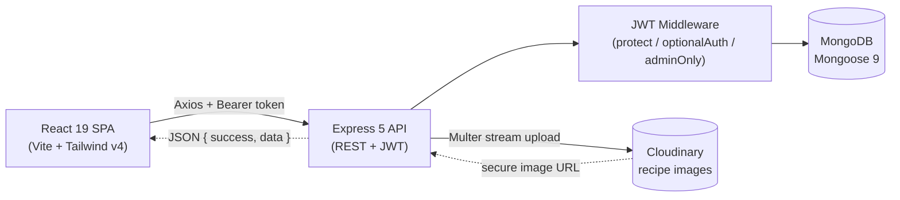

# Recipe MERN — Step-by-Step Build Guide

> **Archived: original build playbook.** This document is the original, ordered roadmap used to build the Recipe MERN platform from an empty folder to a deployed full-stack application. It is preserved as a "making-of" reference. The codebase may have evolved since this guide was written, so for the current setup, architecture, and deployment notes always defer to [`../README.md`](../README.md).

---

> **Project Summary:** Recipe MERN is a full-stack recipe sharing platform. Visitors can browse, search, filter, and sort published recipes; registered users can author recipes (with Cloudinary images, dynamic ingredient/step editors, and draft/published status), like and favorite recipes, manage a public profile, and tune appearance/privacy preferences; administrators get a dashboard with platform statistics, user management, and recipe moderation. The backend is a security-hardened Express 5 REST API (Helmet with a Swagger-compatible CSP, rate limiting, Mongo sanitization, HPP, express-validator) backed by MongoDB via Mongoose 9, with JWT auth and role-based access control. The frontend is a React 19 SPA built with Vite, Tailwind CSS v4, React Router 7, and an Axios service layer.

Each step below is a self-contained prompt. Execute them in order.

Stack: Node.js, Express 5, MongoDB + Mongoose 9, JWT (jsonwebtoken) + bcryptjs, Cloudinary + Multer, express-validator, Helmet, express-rate-limit, HPP, Swagger (swagger-jsdoc + swagger-ui-express) · React 19, Vite 8, Tailwind CSS 4, React Router 7, Axios, @dnd-kit, Lucide React, react-hot-toast.

---

## Table of Contents

**PHASE 1 — Backend Foundation**

- STEP 1 — Project Scaffolding & Dependency Setup
- STEP 2 — Environment Config & Database Connection
- STEP 3 — Security Middleware & App Composition
- STEP 4 — User Model & JWT Auth Utilities

**PHASE 2 — Backend Resources**

- STEP 5 — Authentication (Validators, Controller, Routes)
- STEP 6 — Recipe Model & Validators
- STEP 7 — Recipe Controller & Routes
- STEP 8 — Cloudinary Upload Pipeline
- STEP 9 — Favorites Resource
- STEP 10 — Admin Resource
- STEP 11 — Swagger Documentation & Seed Scripts

**PHASE 3 — Client Foundation**

- STEP 12 — Vite + React + Tailwind v4 Setup
- STEP 13 — Axios Service Layer & Interceptors
- STEP 14 — Auth & Preferences Contexts
- STEP 15 — Routing, Layouts & Route Guards

**PHASE 4 — Client Pages**

- STEP 16 — Recipe Browsing (Home, Search, Filter, Grid)
- STEP 17 — Recipe Detail Page
- STEP 18 — Create / Edit Recipe
- STEP 19 — Auth Pages, My Recipes & Favorites
- STEP 20 — Settings & Public Profile
- STEP 21 — Admin Dashboard, Users & Recipes

**PHASE 5 — Polish & Deploy**

- STEP 22 — Accessibility, Responsive & Loading Polish
- STEP 23 — Deployment (Render + Netlify)

**Appendices**

- Appendix A — Shared Constants
- Appendix B — API Response & Error Conventions
- Appendix C — Common Pitfalls
- Appendix D — Pre-flight Checklist

---

## Global Build Rules (apply to EVERY step)

- **No git operations.** Do not run `git` commands, do not commit, and do not push. Version control is handled manually by the user.
- **No unapproved dependencies.** Only install the packages named in a step. Prefer native methods over new dependencies.
- **No long-running processes** unless explicitly requested (dev servers, watchers, etc.).
- **Treat every step as self-contained.** Re-read the relevant files before editing and keep changes scoped to the step's intent.
- **Code quality first.** Clean, readable, modern JavaScript (ES6+, async/await, React Hooks). English, descriptive, camelCase identifiers.
- **Security, performance, and accessibility are always priorities.**
- **Consistent API envelope.** Every response is `{ success, data }` or `{ success, message }` (see Appendix B).

---

## Architecture at a Glance



The client calls a versionless `/api` surface through a single Axios instance that injects the JWT and handles `401`s. The API validates and sanitizes input, enforces auth/role rules, talks to MongoDB through Mongoose models, and streams image uploads to Cloudinary. Swagger UI documents every route at `/api-docs`.

---

# PHASE 1 — BACKEND FOUNDATION

---

## STEP 1 — Project Scaffolding & Dependency Setup

**Goal:** Create the monorepo layout and initialize the Express server package.

**Files/folders:**

- Root: `client/`, `server/`, `.gitignore`
- `server/package.json` with `"type": "module"` and scripts: `dev` (nodemon), `start`, `seed`, `seed:recipes`

**Dependencies (server):**

```bash
cd server
npm install express cors helmet hpp dotenv jsonwebtoken bcryptjs mongoose \
  express-validator express-rate-limit slugify multer multer-storage-cloudinary \
  cloudinary swagger-jsdoc swagger-ui-express
npm install -D nodemon
```

**Implementation notes:**

- `.gitignore` must ignore `node_modules/`, `.env`, `.env.*`, `dist/`, `build/`, `uploads/`, logs, and editor folders.
- Use ES modules everywhere (`import`/`export`).

**Acceptance:** `server/` installs cleanly; `npm run dev` is wired (it will fail until `index.js` exists — that is expected).

---

## STEP 2 — Environment Config & Database Connection

**Goal:** Centralize environment loading/validation and connect to MongoDB.

**Files:**

- `server/config/env.js` — load `dotenv`, export a typed `env` object with sane dev defaults
- `server/config/db.js` — Mongoose connection helper
- `server/.env.example` — documented placeholders (no real secrets)

**Implementation notes:**

- Required vars: `NODE_ENV`, `PORT`, `MONGO_URI`, `JWT_SECRET`, `JWT_EXPIRES_IN`, `CORS_ORIGIN`, `CLOUDINARY_CLOUD_NAME`, `CLOUDINARY_API_KEY`, `CLOUDINARY_API_SECRET`.
- In production, **throw** if `JWT_SECRET` is shorter than 32 chars or Cloudinary credentials are missing. Dev may fall back to safe defaults.

**Acceptance:** Importing `env` returns validated values; `connectDB()` resolves against a local or Atlas instance.

---

## STEP 3 — Security Middleware & App Composition

**Goal:** Compose the Express app with the full security stack and a clean error pipeline.

**Files:**

- `server/middlewares/sanitize.js` — Express 5 compatible Mongo sanitizer (strips keys matching `^\$|\..*\$`; only touch `req.body` and `req.params` because `req.query` is read-only in Express 5)
- `server/middlewares/rateLimiter.js` — `globalLimiter`, `authLimiter`, `uploadLimiter`, `adminLimiter`, `likeLimiter`
- `server/middlewares/errorHandler.js` — normalizes CastError, duplicate key, ValidationError, JWT errors; hides stack outside development
- `server/index.js` — app composition

**Implementation notes:**

- Order matters: `helmet` → disable `x-powered-by` → `cors({ origin: env.CORS_ORIGIN, credentials: true })` → `express.json({ limit: '10kb' })` + urlencoded → `sanitizeMongo` → `hpp()` → `globalLimiter` → routes → 404 → `errorHandler`.
- Configure Helmet's CSP rather than disabling it: allow `'unsafe-inline'` for scripts/styles (needed by Swagger UI and the welcome page), allow `data:`/`https:` images and fonts, set `objectSrc: 'none'`, and remove `upgrade-insecure-requests` so localhost/Swagger "Try it out" works.
- Add a themed `GET /` welcome page and a `GET /api/health` check.

**Acceptance:** Server boots, `/api/health` returns `{ success: true }`, and security headers are present.

---

## STEP 4 — User Model & JWT Auth Utilities

**Goal:** Model users with embedded preferences and provide token helpers.

**Files:**

- `server/models/User.js` — fields: `name`, `email` (unique, lowercase), `password` (`select: false`), `avatar`, `bio`, `role` (`user`/`admin`), `favorites` (refs to Recipe), embedded `preferences` subdocument (theme, fontSize, contentDensity, animations, language, privacy)
- `server/utils/generateToken.js` — sign a JWT with the user id and `env.JWT_EXPIRES_IN`

**Implementation notes:**

- Hash passwords in an async `pre('save')` hook (bcrypt, 12 salt rounds) guarded by `isModified('password')`.
- Add a `comparePassword` instance method.
- Mongoose 9 uses `next`-less async pre-save hooks.

**Acceptance:** Creating a user hashes the password; `comparePassword` validates correctly; tokens verify with `JWT_SECRET`.

---

# PHASE 2 — BACKEND RESOURCES

---

## STEP 5 — Authentication (Validators, Controller, Routes)

**Goal:** Full auth surface: register, login, profile, password, preferences, account deletion, public profiles.

**Files:**

- `server/validators/authValidator.js` — register/login/updateProfile/changePassword/deleteAccount/updatePreferences rule sets
- `server/middlewares/validate.js` — runs `validationResult` and returns a joined `400` message
- `server/middlewares/authMiddleware.js` — `protect`, `optionalAuth`, `adminOnly`
- `server/controllers/authController.js`
- `server/routes/authRoutes.js`

**Implementation notes:**

- Always return a sanitized user object (never the password hash).
- `updatePreferences` must whitelist allowed enum values before assigning.
- Account deletion must cascade: delete the user's recipes (and their Cloudinary images), pull the user from others' `favorites` and recipe `likes`.
- Apply `authLimiter` to `/register` and `/login`.

**Acceptance:** Register/login return `{ user, token }`; protected routes reject missing/invalid tokens with `401`.

---

## STEP 6 — Recipe Model & Validators

**Goal:** Model recipes with embedded ingredients, slug generation, and a denormalized like counter.

**Files:**

- `server/models/Recipe.js`
- `server/validators/recipeValidator.js`

**Implementation notes:**

- Fields: `title`, `slug` (unique, lowercase), `description`, `ingredients` (embedded `{ amount, unit, name }`), `steps` (string array), `category` (enum), `cookTime`, `prepTime`, `servings`, `difficulty` (enum), `image`, `imagePublicId`, `author` (ref User), `likes` (refs User), `likesCount` (Number, default 0), `status` (`draft`/`published`), `tags`.
- Generate the slug in a `pre('save')` hook with `slugify` and a uniqueness suffix fallback.
- Indexes: text index on `title/description/tags`; `{ category, status }`; `{ author }`; `{ createdAt: -1 }`; `{ status, likesCount: -1 }` for popularity sorting.
- Virtuals: `likeCount` (from `likes.length`) and `totalTime`; enable virtuals in `toJSON`/`toObject`.
- **Validators (critical):** build body rules from a factory function so the update rule set can call `.optional()` on fresh chains. Never `.optional()`-map the create rules in place — express-validator chains are mutable and would corrupt the create validators (see Appendix C).

**Acceptance:** Creating a recipe auto-generates a unique slug; `likesCount` defaults to 0; indexes are declared.

---

## STEP 7 — Recipe Controller & Routes

**Goal:** Recipe CRUD plus search/filter/sort/pagination and like toggling.

**Files:**

- `server/controllers/recipeController.js`
- `server/routes/recipeRoutes.js`

**Implementation notes:**

- `getAllRecipes`: filter `status: 'published'`; optional `search` (escaped regex on title), `category`, `difficulty`; sort map `{ newest, oldest, popular: { likesCount: -1, createdAt: -1 }, quickest }`; clamp `page`/`limit`.
- Route order: define `/my`, `/slug/:slug`, then `/:id` so static paths are not swallowed by the id param.
- `getRecipeById` reveals drafts only to the owner or an admin (use `optionalAuth`).
- Ownership check on update/delete (owner or admin), and clean up Cloudinary images on image replacement/delete.
- `toggleLike`: keep `likes` and `likesCount` in sync atomically (`$addToSet`/`$pull` + `$inc`); return `likeCount` from the array length for accuracy.
- Apply `likeLimiter` to the like route.

**Acceptance:** Listing supports search/filter/sort/pagination; popular sort orders by like count; like toggling returns the new count.

---

## STEP 8 — Cloudinary Upload Pipeline

**Goal:** Authenticated image uploads to Cloudinary via Multer.

**Files:**

- `server/config/cloudinary.js` — configure the SDK from env
- `server/middlewares/upload.js` — `multer-storage-cloudinary` storage, MIME whitelist, size limit
- `server/utils/helpers.js` — `escapeRegex` and `deleteCloudinaryImage` (fails silently)

**Implementation notes:**

- `POST /api/recipes/upload` is `protect` + `uploadLimiter` + `upload.single('image')`; respond with `{ url, publicId }`.
- Validate MIME types (images only) and cap file size.

**Acceptance:** Authenticated upload returns a secure URL and public id; non-images are rejected.

---

## STEP 9 — Favorites Resource

**Goal:** Toggle and list a user's favorite recipes.

**Files:**

- `server/validators/favoriteValidator.js`
- `server/controllers/favoriteController.js`
- `server/routes/favoriteRoutes.js`

**Implementation notes:**

- `GET /api/favorites` (paginated), `PUT /api/favorites/:recipeId` (toggle, `likeLimiter`), `GET /api/favorites/check/:recipeId`.
- Store favorites as recipe refs on the User document; only count/list published recipes when surfacing them publicly.

**Acceptance:** Toggling adds/removes the recipe from the user's favorites and returns the updated state.

---

## STEP 10 — Admin Resource

**Goal:** Admin-only dashboard, user management, and recipe moderation.

**Files:**

- `server/validators/adminValidator.js`
- `server/controllers/adminController.js`
- `server/routes/adminRoutes.js`

**Implementation notes:**

- Guard the whole router with `router.use(protect, adminOnly, adminLimiter)`.
- Dashboard aggregates totals, category breakdown, most-liked recipes (sort by `likesCount`), and newest users/recipes via `Promise.all`.
- Protect the last admin: block self role-change/self-delete and prevent removing/demoting the final admin.
- Deleting a user cascades like account deletion (recipes, Cloudinary images, favorites, likes).

**Acceptance:** Non-admins receive `403`; admin endpoints return stats and enforce last-admin safety.

---

## STEP 11 — Swagger Documentation & Seed Scripts

**Goal:** Document the API and provide seed data.

**Files:**

- `server/config/swagger.js` — OpenAPI 3 definition (schemas: User, Preferences, Ingredient, Recipe, UserSummary, Error, PaginationMeta), `bearerAuth` security scheme, `apis: ['./routes/*.js']`
- JSDoc `@swagger` annotations on each route file
- `server/utils/seed.js` — create the initial admin user
- `server/utils/seedRecipes.js` — seed sample recipes authored by the admin

**Implementation notes:**

- Mount Swagger UI at `/api-docs` (hide the topbar; custom site title).
- `seedRecipes` should no-op if recipes already exist and require an existing admin.

**Acceptance:** `/api-docs` renders all routes; `npm run seed` then `npm run seed:recipes` populates the database.

---

# PHASE 3 — CLIENT FOUNDATION

---

## STEP 12 — Vite + React + Tailwind v4 Setup

**Goal:** Scaffold the React 19 SPA with Vite and Tailwind v4.

**Dependencies (client):**

```bash
cd client
npm install react react-dom react-router-dom axios react-hot-toast lucide-react \
  @dnd-kit/core @dnd-kit/sortable @dnd-kit/utilities
npm install -D vite @vitejs/plugin-react tailwindcss @tailwindcss/vite eslint
```

**Files:**

- `client/vite.config.js` — React + `@tailwindcss/vite` plugins; dev server on `5173` with a `/api` proxy to `http://localhost:5000`
- `client/index.html`, `client/src/main.jsx`, `client/src/index.css`
- `client/public/_redirects` (`/* /index.html 200`), `favicon.svg`, `icons.svg`

**Implementation notes:**

- Tailwind v4 uses CSS-first config: import Tailwind and declare theme tokens in `index.css` (`@theme`). Define theme/font-size/density utility classes and a `.no-animations` escape hatch.
- Wrap the app in `StrictMode`, an `ErrorBoundary`, `AuthProvider`, `PreferencesProvider`, and a `Toaster`.

**Acceptance:** `npm run dev` serves the SPA; Tailwind classes and theme tokens apply.

---

## STEP 13 — Axios Service Layer & Interceptors

**Goal:** A single API client plus thin per-resource service wrappers.

**Files:**

- `client/src/services/api.js` — Axios instance (`baseURL` from `VITE_API_URL` or `/api`), request interceptor attaching the Bearer token and stripping `Content-Type` for `FormData`, response interceptor clearing storage and redirecting on `401` (skip the silent `/auth/me` check)
- `client/src/services/{authService,recipeService,favoriteService,adminService,userService}.js`

**Implementation notes:**

- Keep services declarative (one function per endpoint). Business logic lives in contexts/pages.

**Acceptance:** Authenticated requests carry the token; `401`s log the user out gracefully.

---

## STEP 14 — Auth & Preferences Contexts

**Goal:** Global auth state and theme/preferences with server sync.

**Files:**

- `client/src/contexts/AuthContext.jsx` + `client/src/hooks/useAuth.js`
- `client/src/contexts/PreferencesContext.jsx` + `client/src/hooks/usePreferences.js`
- `client/src/hooks/useDebounce.js`, `client/src/hooks/useLocalStorage.js`

**Implementation notes:**

- `AuthContext`: validate the stored token on mount via `/auth/me`; expose `login`, `register`, `logout`, `updateUser`, plus `isAuthenticated`/`isAdmin`. Memoize the context value.
- `PreferencesContext`: read from `localStorage`, resolve `system` theme via `matchMedia`, apply theme/font-size/density/animation classes to `document.documentElement`, and sync changes to the server when authenticated.

**Acceptance:** Refreshing keeps the session; toggling theme persists locally and to the server.

---

## STEP 15 — Routing, Layouts & Route Guards

**Goal:** Define routes with nested layouts and access guards.

**Files:**

- `client/src/App.jsx`
- `client/src/components/layout/{MainLayout,AdminLayout,SettingsLayout,Navbar,Footer}.jsx`
- `client/src/components/guards/{ProtectedRoute,AdminRoute,GuestOnlyRoute}.jsx`
- `client/src/components/ui/ScrollToTop.jsx`, `client/src/components/ErrorBoundary.jsx`

**Implementation notes:**

- Public routes (home, recipe detail, public profile), guest-only routes (login/register), protected routes (create/edit, my recipes, favorites, settings), and an admin section under `/admin`.
- Guards should show a spinner while auth is initializing to avoid redirect flicker.

**Acceptance:** Unauthorized users are redirected; admins reach `/admin`; deep links restore correctly.

---

# PHASE 4 — CLIENT PAGES

---

## STEP 16 — Recipe Browsing (Home, Search, Filter, Grid)

**Goal:** The discovery surface with search, filters, sorting, pagination, and skeletons.

**Files:**

- `client/src/pages/HomePage.jsx`
- `client/src/components/recipe/{SearchBar,CategoryFilter,RecipeGrid,RecipeCard}.jsx`
- `client/src/components/ui/{Pagination,RecipeCardSkeleton,EmptyState,Spinner}.jsx`
- `client/src/utils/constants.js`

**Implementation notes:**

- Debounce search input; keep filter/sort/page state in sync with the query string where helpful.
- `RecipeCard` reads `likeCount`, computes total time, and renders category/difficulty badges.

**Acceptance:** Browsing reflects filters/sort/pagination; loading shows skeletons; empty results show an empty state.

---

## STEP 17 — Recipe Detail Page

**Goal:** Full recipe view with author info, like/favorite actions, and owner controls.

**Files:**

- `client/src/pages/RecipeDetailPage.jsx`
- `client/src/components/ui/RecipeDetailSkeleton.jsx`

**Implementation notes:**

- Fetch by slug; show ingredients, ordered steps, metadata, and author card.
- Like and favorite buttons update optimistically; owners/admins see edit/delete.

**Acceptance:** Detail renders by slug; like/favorite reflect immediately; owner actions appear only when authorized.

---

## STEP 18 — Create / Edit Recipe

**Goal:** Rich recipe authoring with dynamic, reorderable fields and image upload.

**Files:**

- `client/src/pages/{CreateRecipePage,EditRecipePage}.jsx`
- `client/src/components/recipe/{IngredientForm,StepForm}.jsx`
- `client/src/components/ui/{CharacterCounter,SelectableCard,ToggleSwitch,StatusBadge}.jsx`

**Implementation notes:**

- Use `@dnd-kit` sortable lists for ingredients and steps.
- Upload the image first (`/recipes/upload`), then submit the recipe with the returned `url`/`publicId`.
- Mirror server validation client-side (lengths, required fields, enums) and show character counters.

**Acceptance:** Users can create/edit recipes, reorder items via drag-and-drop, upload an image, and save drafts or publish.

---

## STEP 19 — Auth Pages, My Recipes & Favorites

**Goal:** Authentication screens and personal recipe collections.

**Files:**

- `client/src/pages/auth/{LoginPage,RegisterPage}.jsx`
- `client/src/pages/{MyRecipesPage,FavoritesPage}.jsx`

**Implementation notes:**

- Login/register validate inputs and surface server errors via toasts.
- "My Recipes" supports status filtering; "Favorites" lists the user's saved recipes with pagination.

**Acceptance:** Auth flows work end to end; personal lists paginate and reflect server state.

---

## STEP 20 — Settings & Public Profile

**Goal:** Tabbed settings and privacy-aware public profiles.

**Files:**

- `client/src/pages/SettingsPage.jsx` (tabs: profile, account, appearance, privacy) via `SettingsLayout`
- `client/src/pages/user/ProfilePage.jsx`
- `client/src/components/ui/RoleBadge.jsx`

**Implementation notes:**

- Appearance tab drives `PreferencesContext`; account tab handles password change and account deletion (with confirmation modal).
- Public profile respects `privacy.showEmail`/`showFavorites`; owners always see their own data.

**Acceptance:** Settings persist; profiles hide private data from other users.

---

## STEP 21 — Admin Dashboard, Users & Recipes

**Goal:** Admin console for stats, user management, and moderation.

**Files:**

- `client/src/pages/admin/{AdminDashboardPage,AdminUsersPage,AdminRecipesPage}.jsx`
- `client/src/components/ui/ConfirmModal.jsx`

**Implementation notes:**

- Dashboard visualizes totals, category breakdown, most-liked, and newest items.
- User management supports search, role change, and deletion (guarded by last-admin rules server-side); recipe management supports search/filter and deletion.

**Acceptance:** Admin views render stats and lists; destructive actions require confirmation and respect server guards.

---

# PHASE 5 — POLISH & DEPLOY

---

## STEP 22 — Accessibility, Responsive & Loading Polish

**Goal:** Final UX hardening.

**Implementation notes:**

- Verify keyboard navigation, focus states, and ARIA labels on interactive controls and the drag-and-drop lists.
- Confirm mobile-first responsiveness across breakpoints.
- Ensure every async surface has a skeleton/spinner and a graceful empty/error state.
- Respect the `no-animations` preference.

**Acceptance:** Core flows are keyboard-accessible, responsive, and never show raw loading gaps.

---

## STEP 23 — Deployment (Render + Netlify)

**Goal:** Ship the API and SPA.

**Implementation notes:**

- **Backend (Render):** root `server`, build `npm install`, start `npm start`; set all env vars; set `NODE_ENV=production` and a 32+ char `JWT_SECRET`; set `CORS_ORIGIN` to the Netlify domain.
- **Frontend (Netlify):** base `client`, build `npm run build`, publish `dist`; ensure `_redirects` exists; set `VITE_API_URL` to the Render URL + `/api`.
- Confirm `CORS_ORIGIN` matches the deployed frontend exactly.

**Acceptance:** The deployed SPA talks to the deployed API; auth, uploads, and admin all work in production.

---

# Appendix A — Shared Constants

- **Categories:** `Breakfast`, `Main Course`, `Dessert`, `Beverage`, `Snack`, `Soup`, `Salad`
- **Difficulties:** `Easy`, `Medium`, `Hard`
- **Sort options:** `newest`, `oldest`, `popular`, `quickest`
- **Recipe status:** `draft`, `published`
- **Roles:** `user`, `admin`
- **Pagination defaults:** recipes `limit=12` (max 50), admin lists `limit=20` (max 50)
- Keep these mirrored between `server` enums/validators and `client/src/utils/constants.js`.

---

# Appendix B — API Response & Error Conventions

- **Success:** `{ "success": true, "data": { ... } }`
- **Message-only success:** `{ "success": true, "message": "..." }`
- **Error:** `{ "success": false, "message": "..." }` (plus `stack` only in development)
- **Auth header:** `Authorization: Bearer <token>`
- **Validation errors** are joined into a single human-readable `message` by the `validate` middleware.
- **Status codes:** `400` validation/duplicate, `401` unauthenticated/invalid token, `403` forbidden (role/ownership), `404` not found, `500` unexpected.

---

# Appendix C — Common Pitfalls

- **Validator chain mutation:** `createRules.map(r => r.optional())` mutates the shared chains in place and silently makes the create validators optional too. Build rules from a factory function and derive the update set from a fresh build.
- **"Popular" sort on an array:** sorting by `{ likes: -1 }` compares array elements, not size. Maintain a denormalized `likesCount` and sort by it (kept in sync on like toggles).
- **Express 5 sanitization:** `req.query` is a read-only getter in Express 5, so `express-mongo-sanitize` breaks. Use a custom sanitizer that only mutates `req.body`/`req.params`.
- **Helmet + Swagger CSP:** a default strict CSP blocks Swagger UI's inline scripts/styles. Allow `'unsafe-inline'` for scripts/styles and drop `upgrade-insecure-requests` so localhost works.
- **Route ordering:** declare `/recipes/my` and `/recipes/slug/:slug` before `/recipes/:id`.
- **Cascade cleanup:** when deleting users/recipes, also remove Cloudinary images and pull references from `favorites` and `likes`.

---

# Appendix D — Pre-flight Checklist

- [ ] `server/.env` populated; production secrets meet length/credential requirements
- [ ] MongoDB reachable; indexes created on boot
- [ ] `npm run seed` (admin) and optionally `npm run seed:recipes` executed
- [ ] Swagger UI loads at `/api-docs` with CSP enabled
- [ ] Auth, recipe CRUD, upload, like/favorite, and admin flows verified
- [ ] Client `VITE_API_URL` / dev proxy points to the API
- [ ] `CORS_ORIGIN` matches the deployed frontend
- [ ] Lint passes on both `client` and `server`

